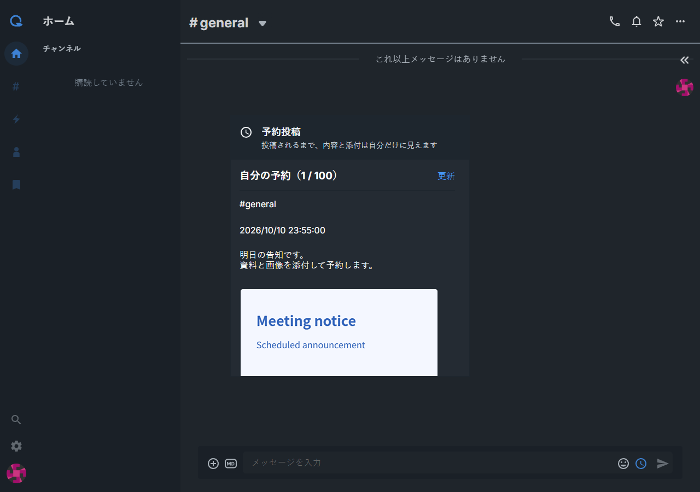
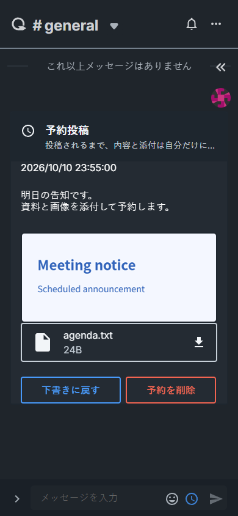

# 予約投稿

投稿入力欄の時計ボタンから、現在の下書きに投稿日時を指定できます。
通常のチャンネルと DM に対応し、画像やファイルも添付できます。
日時はブラウザーのタイムゾーンで表示します。

予約一覧には自分の未送信・送信失敗の予約が表示されます。本文と添付は
投稿されるまで自分だけが閲覧でき、投稿後は送信先の公開範囲が適用されます。
未送信・失敗の予約は合計 100 件までです。

内容や時刻を変える場合は「下書きに戻す」を選び、修正して予約し直します。
本文と添付を保存してから予約を取り消し、送信先の入力欄に復元します。
すでに入力している下書きがある場合は、末尾に追加します。
「予約を削除」は確認後に予約と添付を削除し、下書きには戻しません。

サーバーの停止中に予定時刻を過ぎた予約は、復旧後に投稿されます。
投稿者の権限や送信先の状態が変わった場合は、送信失敗の理由を表示します。
送信済みの予約は取り消せません。繰り返し投稿や予約の直接編集には対応していません。

対応する traQ バックエンドの予約投稿 API が必要です。
既存の SDK に API 定義が追加されるまでは `src/lib/scheduledMessages.ts` の
型付き HTTP 呼び出しを使用します。

| PC                            | モバイル（390px）                 |
| ----------------------------- | --------------------------------- |
|  |  |
